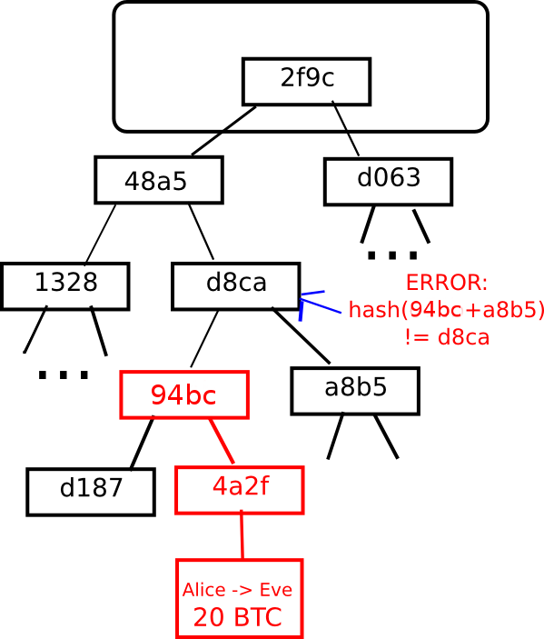

# 基本概念和术语

## 区块链

区块链是基于共识机制，去中心化的公开数据库，也可以说是一个分布式账本。 区块链是传递价值，记录价值，传递信息完成价值转移的公开账本。 系统有如下特点：

* 分布式
* 自治
* 按照合约执行
  1. 按照既定规则执行
  2. 智能合约通过验证才可以进行交易
* 可追溯

## 比特币

比特币账本可以看成是一个状态转移的系统，该系统包括所有现存的比特币所有权状态和“状态转换函数”。每个区块包含一个时间戳、一个随机数、一个对上一个区块的引用（即哈希）和上一区块生成以来发生的所有交易列表。 一个区块的Hash实际是区块头的Hash. 区块头包含了区块的随机数，时间戳，上个区块Hash当前区块交易的默克尔树的根节点的Hash值（默克尔树的根Hash长度约为200个字节）。

### 默克尔树

默克尔树是一种二叉树，由一组叶节点、一组中间节点和一个根节点构成。最下面的大量的叶节点包含基础数据，每个中间节点是它的两个子节点的哈希，根节点也是由它的两个子节点的哈希，代表了默克尔树的顶部。 任何尝试修改默克尔树结构节点的行为，都会导致节点上数据的不一致。 

### 比特币地址

比特币地址=Hash\(公钥\) 用户平常看到的比特币地址都是经过Base58Check编码的。

### Base58

Base58是用于Bitcoin中使用的一种独特的编码方式，主要用于产生Bitcoin的钱包地址。相比Base64，Base58不使用数字"0"，字母大写"O"，字母大写"I"，和字母小写"l"，以及"+"和"/"符号

### 比特币交易单位

1BTC = 1 0000 0000 聪

### 比特币交易类型

* 支付到公钥Hash
* 支付到脚本Hash
* 挖矿交易

### 比特币挖矿难度

比特币通过调整挖矿难度控制挖矿产生速度，以保证每10分钟产生一个区块。目前每产生2016个区块就会调整难度，目前产生区块奖励25个比特币，这个数量每产生210000个区块减半（约等于4年）。

### PoW

Proof of Work。

### PoS

Proof of Stake。

### DPoS

Delegated Proof of Stake。

### 侧链（SideChain）

侧链由Blockstram开发，使用楔入式侧链技术。 遵守侧链协议的所有区块链，如以太坊，莱特币，狗狗币等，可以和主链转移货币。

### 闪电网络

闪电网络是为了解决比特币网络的TPS问题，主要思路是把大量交易放到比特币网络之外进行。 核心的概念主要有两个：RSMC（Recoverable Sequence Maturity Contract）和 HTLC（Hashed Timelock Contract）。前者解决了链下交易的确认问题，后者解决了支付通道的问题。

## 以太坊

以太坊的目的是基于脚本、竞争币和链上元协议（on-chain meta-protocol）概念进行整合和提高，使得开发者能够创建任意的基于共识的、可扩展的、标准化的、特性完备的、易于开发的和协同的应用。 以太坊通过建立终极的抽象的基础层-内置有图灵完备编程语言的区块链-使得任何人都能够创建合约和去中心化应用并在其中设立他们自由定义的所有权规则、交易方式和状态转换函数。

### 以太坊账户

在以太坊系统中，状态是由被称为“账户”（每个账户由一个20字节的地址）的对象和在两个账户之间转移价值和信息的状态转换构成的。 以太坊的账户包含四个部分：

* 随机数，用于确定每笔交易只能被处理一次的计数器
* 账户目前的以太币余额
* 账户的合约代码，如果有的话
* 账户的存储（默认为空）

  以太坊账户类型主要有两种

* 外部账户（由私钥控制）
* 合约账户（由合约代码控制）

### 消息和交易

以太坊的消息在某种程度上类似于比特币的交易，但是两者之间存在三点重要的不同。第一，以太坊的消息可以由外部实体或者合约创建，然而比特币的交易只能从外部创建。第二，以太坊消息可以选择包含数据。第三，如果以太坊消息的接受者是合约账户，可以选择进行回应，这意味着以太坊消息也包含函数概念。 交易包含消息的接收者、用于确认发送者的签名、以太币账户余额、要发送的数据和两个被称为STARTGAS和GASPRICE的数值。 创建合约有单独的交易类型和相应的消息类型；合约的地址是基于账号随机数和交易数据的哈希计算出来的。

